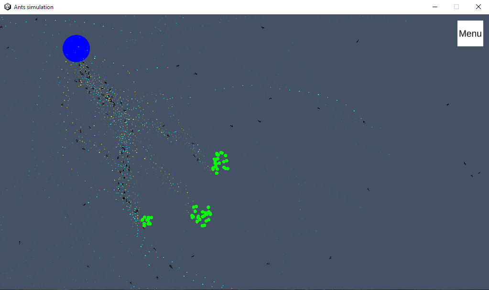
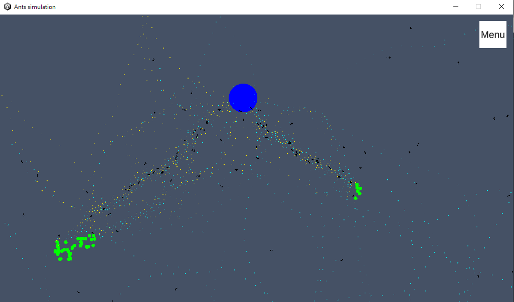

# Ants-simulation
## Simulation of forming paths using ant colony optimization algorithm

Authors:
Splexu - Michał Cierpicki
GaguSUS - Krzysztof Gągało
PiotrFoltyniewicz - Piotr Foltyniewicz

Executable simulation for Windows is in Ants-simulation.zip

Instruction to run project in Unity
1. Open Unity Hub.
2. Open cloned project by Unity Hub (Projects > Open > Add project from disk).
3. Run the project.

Repository contains PDF file with graphic instruction to run project in Unity

Disclaimer: Project was made using Unity 2021.2.5f1
